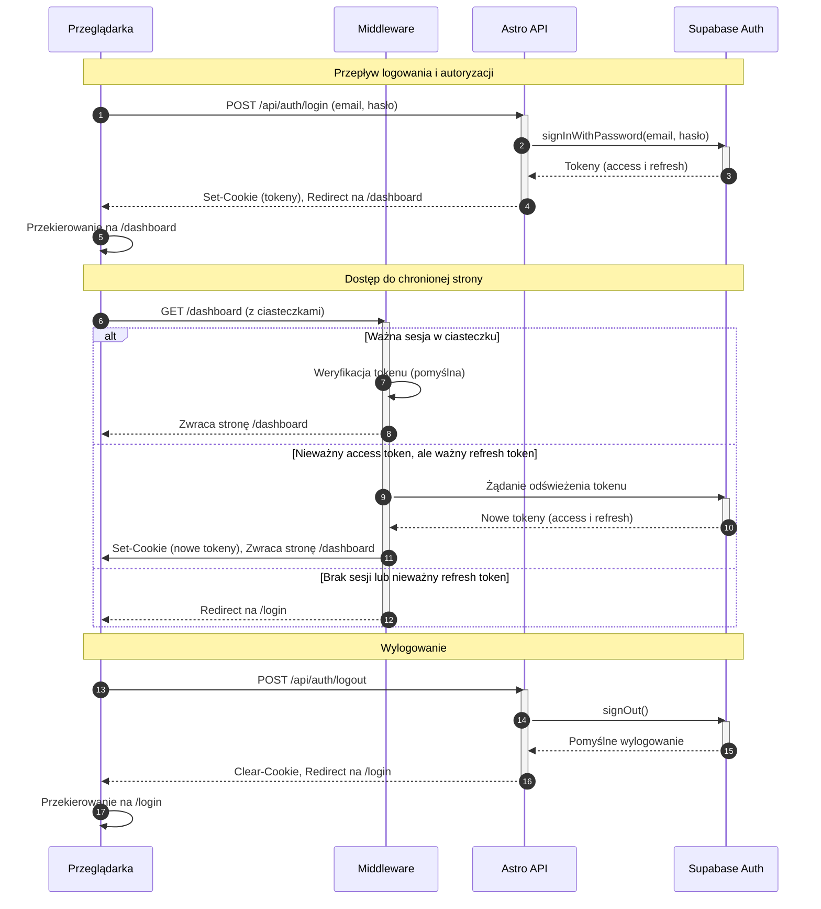

<authentication_analysis>
1.  **Przepływy Autentykacji:**
    *   **Rejestracja Użytkownika (US-001):** Nowy użytkownik tworzy konto przy użyciu adresu e-mail i hasła.
    *   **Logowanie Użytkownika (US-001):** Zarejestrowany użytkownik loguje się do systemu.
    *   **Wylogowanie Użytkownika (US-002):** Zalogowany użytkownik kończy swoją sesję.
    *   **Odzyskiwanie Hasła (US-015):** Użytkownik, który zapomniał hasła, może je zresetować.
    *   **Ochrona Ścieżek:** Nieuwierzytelnieni użytkownicy są przekierowywani z chronionych stron na stronę logowania.
    *   **Zarządzanie Sesją:** System zarządza sesją użytkownika poprzez odświeżanie tokenów.

2.  **Główni Aktorzy i Ich Interakcje:**
    *   **Przeglądarka (Użytkownik):** Inicjuje wszystkie działania (logowanie, rejestracja, wylogowanie, żądania do chronionych zasobów).
    *   **Middleware (Astro):** Przechwytuje każde żądanie. Weryfikuje sesję (token JWT w ciasteczku). Jeśli sesja jest nieprawidłowa, próbuje ją odświeżyć. Przekierowuje użytkownika na podstawie jego stanu uwierzytelnienia i strony docelowej.
    *   **API Astro (Endpointy):** Obsługują logikę biznesową (np. `/api/auth/login`, `/api/auth/logout`). Komunikują się z Supabase Auth.
    *   **Supabase Auth:** Zewnętrzna usługa odpowiedzialna za zarządzanie użytkownikami, wydawanie i weryfikację tokenów JWT oraz wysyłanie e-maili (potwierdzenie rejestracji, resetowanie hasła).

3.  **Procesy Weryfikacji i Odświeżania Tokenów:**
    *   **Weryfikacja:** Przy każdym żądaniu do chronionej strony, middleware sprawdza ważność tokenu dostępu przechowywanego w ciasteczku.
    *   **Odświeżanie:** Jeśli token dostępu wygasł, middleware używa tokenu odświeżającego, aby uzyskać nową parę tokenów z Supabase Auth. Nowe tokeny są następnie zapisywane w ciasteczkach. Ten proces jest przezroczysty dla użytkownika.
    *   **Wygaśnięcie Sesji:** Jeśli token odświeżający jest również nieprawidłowy, sesja użytkownika wygasa. Użytkownik musi zalogować się ponownie.

4.  **Opis Kroków Autentykacji:**
    *   **Logowanie:**
        1.  Użytkownik przesyła swój e-mail i hasło z formularza w przeglądarce do endpointu `/api/auth/login`.
        2.  Endpoint wywołuje `supabase.auth.signInWithPassword()`.
        3.  Supabase Auth weryfikuje poświadczenia. Jeśli są poprawne, generuje tokeny (dostępu i odświeżający).
        4.  Endpoint API ustawia tokeny w bezpiecznych, `httpOnly` ciasteczkach w odpowiedzi do przeglądarki.
        5.  Przeglądarka przekierowuje użytkownika na `/dashboard`.
    *   **Dostęp do Chronionej Strony:**
        1.  Przeglądarka wysyła żądanie do chronionej strony (np. `/dashboard`).
        2.  Middleware przechwytuje żądanie i sprawdza ciasteczka w poszukiwaniu tokenów.
        3.  Jeśli tokeny są ważne, middleware zezwala na kontynuację żądania i udostępnia sesję w `context.locals`.
        4.  Jeśli token dostępu wygasł, middleware próbuje go odświeżyć za pomocą tokenu odświeżającego.
        5.  Jeśli odświeżenie się powiedzie, nowe tokeny są zapisywane w ciasteczkach, a żądanie jest kontynuowane.
        6.  Jeśli odświeżenie się nie powiedzie (lub nie ma tokenów), middleware przekierowuje użytkownika na stronę `/login`.
</authentication_analysis>

<mermaid_diagram>

</mermaid_diagram>

